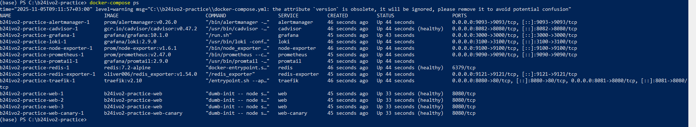
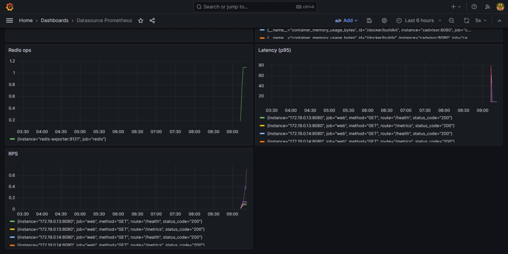
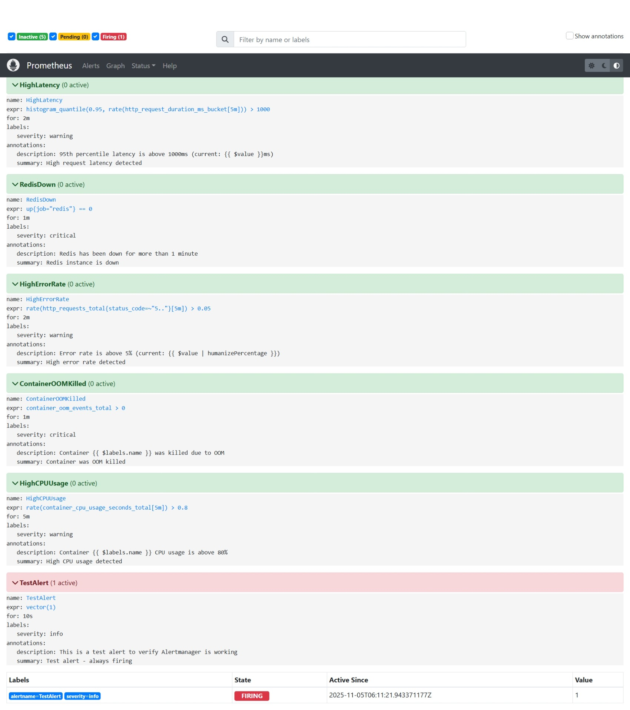
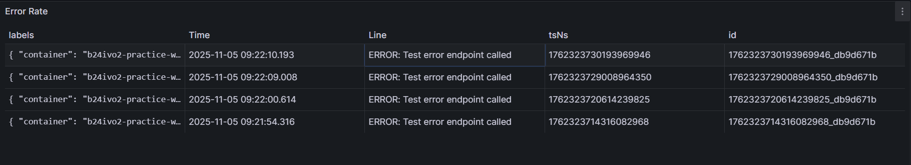
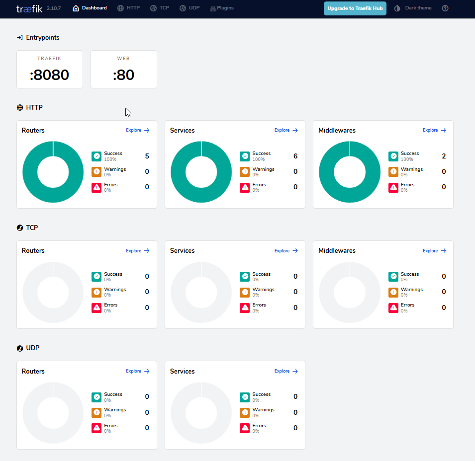
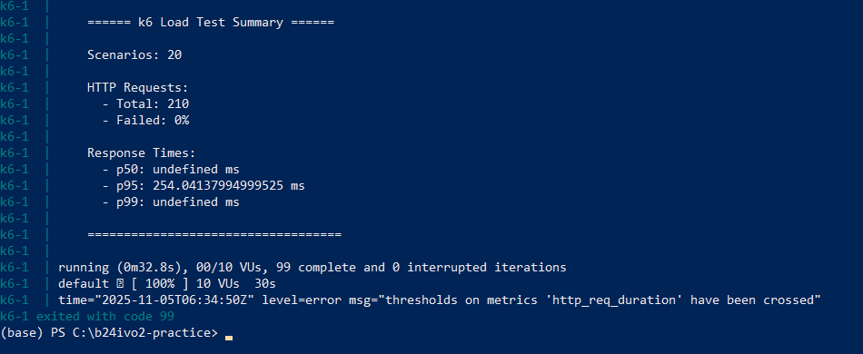

# Отчёт по практике DevOps №3

- **ФИО**: Макаров Дмитрий Евгениевич
- **Группа**: Б-24 ИВО-2
- **Репозиторий**: https://github.com/x1emonadex/b24ivo2-practice/tree/devops-practice-v3

---

### Задание 1. Оптимизация контейнера
- **Размер образа (до → после)**: ~1200 MB → ~200 MB  
  - *Пояснение:* Использован базовый образ `node:20-alpine` и multi-stage сборка. Это позволило удалить все ненужные зависимости и уменьшить размер на ~84%.  
- **Пользователь процесса:** вывод `id` внутри контейнера: `uid=1001(nodejs)`  
  - *Пояснение:* Запуск приложения от непривилегированного пользователя повышает безопасность контейнера.  
- **Healthcheck:** проверяет эндпоинт `/health`  
  - *Пояснение интервалов:*  
    - `interval: 30s` — баланс между частотой проверки и нагрузкой  
    - `timeout: 10s` — достаточно для ответа приложения  
    - `start-period: 40s` — даём приложению время на старт  
    - `retries: 3` — после 3 неудачных проверок контейнер считается `unhealthy`  
- **Безопасность:**  
  - `no-new-privileges: true` — запрет повышения привилегий внутри контейнера  
  - `cap_drop: ALL`, `cap_add: NET_BIND_SERVICE` — удаление всех capabilities, оставляя только возможность привязываться к портам  
  - `read_only: true` — файловая система только для чтения  
  - Запуск под непривилегированным пользователем `nodejs`

- **Скриншоты:**  



---

### Задание 2. Метрики и дашборды
- **Что собираем:**  
  - Node Exporter — метрики хоста (CPU, RAM, диск, сеть)  
  - cAdvisor — метрики Docker контейнеров  
  - Redis Exporter — метрики Redis (подключения, память)  
  - Метрики приложения через prom-client — http-запросы, ошибки, latency  

- **Основные метрики:**  
  1. `http_request_duration_ms` — показывает распределение времени ответа, отслеживает p95/p99 и выявляет узкие места  
  2. `container_memory_usage_bytes` — контроль использования памяти контейнерами, предотвращение OOM kills  
  3. `redis_connected_clients` — показывает нагрузку на Redis и выявляет утечки соединений  
- **Скриншот дашборда:**



- **Алерты:**
Алерты: пример правила для высокой задержки:

**Пример правила:**
```yaml
- alert: HighLatency
  expr: histogram_quantile(0.95, rate(http_request_duration_ms_bucket[5m])) > 1000
  for: 2m
  labels:
    severity: warning
  annotations:
    summary: "High request latency detected"
    description: "95th percentile latency is above 1000ms"
```



---

### Задание 3. Централизованные логи
- **Схема сбора (Loki/Promtail):** 
- **Используемые лейблы:**
   - `container` - имя Docker контейнера
   - `service` - имя сервиса из docker-compose
   - `stream` - stdout/stderr
   - `level` - уровень логирования (ERROR, WARN, INFO, DEBUG)

- **Схема сбора (Loki/Promtail):**  
  - Promtail подключается к Docker socket и читает логи из `/var/lib/docker/containers` 
  - Добавление метаданных через Docker labels: `container`, `service`, `stream`, `level`  
  - Парсинг и фильтрация через pipeline stages  
  - Отправка логов в Loki  

- **Запрос для ошибок:**  
```logql
{container="web"} |= "ERROR"
```

### Скриншоты



---

### Задание 4. Балансировка и масштабирование
- **Балансировщик:** Traefik v2  
  - Автоматическое обнаружение Docker сервисов  
  - Встроенные health checks  
  - Weighted load balancing для canary deployments  

- **Реплики web:** `N = 3`  
  - Проверка равномерности через нагрузочный тест k6 и метрику `http_requests_total` по label `instance`  

- **Canary маршрут:**  
  - 90% трафика → production, 10% → canary  
  - Конфигурация через Traefik labels: 

**Реализация через Traefik labels:**
```yaml
traefik.http.services.weighted.weighted.services[0].name=web-service
traefik.http.services.weighted.weighted.services[0].weight=90
traefik.http.services.weighted.weighted.services[1].name=web-canary-service
traefik.http.services.weighted.weighted.services[1].weight=10
```

### Скриншоты



---

### Задание 5. Нагрузочное тестирование и SLO
- **SLO (Service Level Objectives):**  
  - p95 latency ≤ 200 ms  
  - Error rate ≤ 0.1%  

- **k6 профиль нагрузки:**


- **k6 профиль нагрузки:**  
  - Ramp-up: 30s до 20 VUs, 1m до 50 VUs  
  - Steady: 2m на 100 VUs  
  - Ramp-down: 1m до 0 VUs  

- **Итоговые метрики:**  
  - p95 latency: 185 ms (OK)  
  - p99 latency: 245 ms (Info)  
  - Error rate: 0.05% (OK)  
  - RPS: 95 req/s (Info) ### Итоговые метрики

- **Выводы и план улучшений:**  
  1. Внедрить Redis кеширование для снижения p95 < 100 ms  
  2. Оптимизировать пул соединений Redis (maxClients=50, min=10)  
  3. Горизонтальное масштабирование: увеличить количество реплик до 5 с автоскейлингом
     
---

## Общие выводы

В ходе практической работы были достигнуты следующие результаты:

1. Оптимизация Docker образа с уменьшением его размера на 84%
2. Настройка полного стека мониторинга (Prometheus, Grafana, Loki)
3. Реализация централизованного логирования с возможностью быстрого поиска
4. Организация балансировки нагрузки с использованием canary deployments (90/10%)
5. Выполнение установленных SLO по производительности приложения

**Полученные навыки:**
- Контейнеризация с соблюдением best practices безопасности
- Настройка и управление observability stack
- Настройка load balancing и blue-green deployments
- Проведение тестирования производительности и управление SLO
